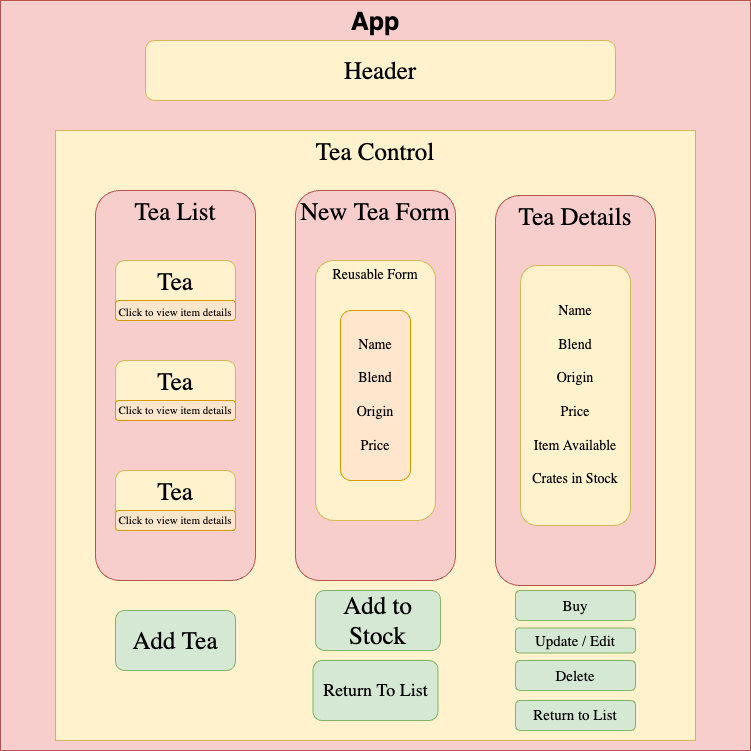

# Rosies Tea House

#### By: Rosie Gardner

## Description
 This web application was created as an Independent Project for React Fundamentals - Introduction to create-react-app, JSX, props, and components. Using full CRUD functionality, this application displays a list of Loose Leaf Tea allowing users to add or purchase items.

 

### Technologies Used

* React
* JavaScript
* JSX
* HTML
* Git

### Setup/Installation Requirements

* Clone or download this repository onto your desktop.
* `https://github.com/rosiegardner/rosies-tea-shop.git`
* Navigate to top-level of directory.
* Open VScode or Text Editor of your choosing.
* In terminal run:
* `npm install`
* `npm run start`

### Known Bugs

* NO KNOWN BUGS

### Contact

* Rosie Gardner <rosiegardner78@gmail.com>

### License

MIT

Copyright (c) Aug. 2022 